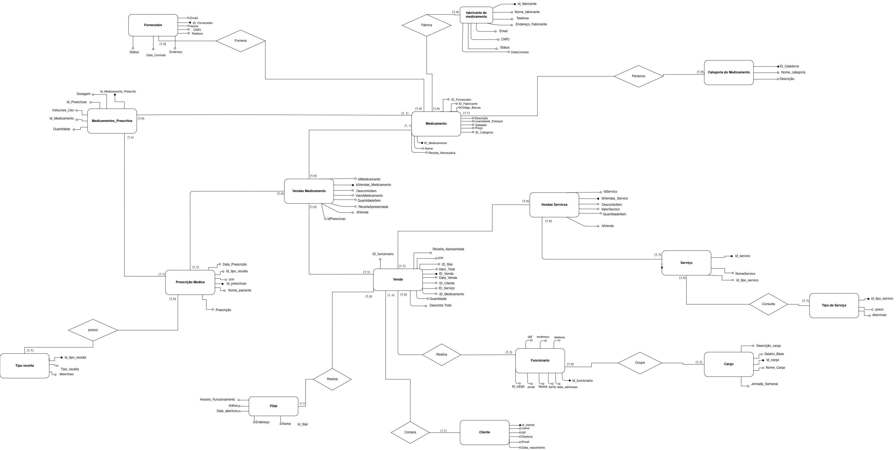
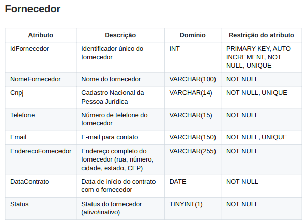

<h1 align="center">Banco de Dados de uma Farmácia</h1>

  

teste

## Sumário

* [Integrantes](#integrantes)
* [Descrição](#descrição)
* [Requisitos](#requisitos)
* [Ferramentas](#ferramentas)
* [Dificuldades](#dificuldades)
* [Resultados](#resultados)
* [Conclusão](#conclusao)

## Integrantes
- Anderson do Vale - [and3510](https://github.com/and3510) 
- Beatriz Barreto - [whosbea](https://github.com/whosbea) 
- Cristovam Paulo - [cristovam10000](https://github.com/cristovam10000) 
- Gustavo do Vale - [gustavodovale](https://github.com/gustavodovale)

## Descrição

Trabalho da Faculdade de Banco de Dados para uma Farmácia

## Requisitos

> O Trabalho consite em criaçao de um documento, banco de dados e uma apresentação

- [x] Capa
- [x] Contracapa
- [x] Sumário
- [x] Introdução
- [x] Ferramentas
- [x] Modelo conceitual
  - [x] Definição do Mini mundo
  - [x] Definição do Dicionário de Dados-DD
  - [x] Criação do Artefato – Modelo de Entidade Relacionamento-MER
- [x] Modelo Lógico
  - [x] Definir normatização do banco
  - [x] Criação do Artefato – Diagrama de Entidade Relacional-DER
  - [x] Criação das tabelas
- [x] Modelo Físico
  - [x] Povoamento (Inserção de registros)
  - [x] Notação de Álgebra Relacional de Banco de dados
  - [x] Consulta SQL
- [x] Considerações finais
- [x] Referências bibliográficas

## Ferramentas

- **MySQL**: Sistema de banco de dados relacional para armazenamento e gerenciamento de dados.
- **MySQL Workbench**: Ferramenta gráfica para design e administração de bancos de dados MySQL.
- **Overleaf**: Plataforma online para edição de documentos em LaTeX, ideal para textos acadêmicos e técnicos.
- **DBeaver**: Ferramenta universal de administração e edição SQL para diversos bancos de dados.

## Dificuldades

- Tivemos dificuldades com a normalização; sempre que finalizávamos uma etapa, uma nova revisão mostrava a necessidade de ajustes adicionais.

- Enfrentamos desafios ao definir as cardinalidades entre as entidades, o que exigiu revisões frequentes para garantir a consistência do modelo.

- Tivemos que revisar as entidades criadas, substituindo alguns atributos, ajustando colunas e removendo certas entidades para melhorar a estrutura do modelo.

- Tivemos que revisar o modelo conforme as normas da ABNT, para criar o documento do trabalho.

## Resultados

- ### Criação do MER - Modelagem de relacionamento de entidades

    

    
    
 Modelo de Entidade Relacionamento-MER 

    

- ### Criação do DER - Diagrama de relacionamento de entidades

    

    
    
 Diagrama de Entidade Relacional-DER 

    

- ### Um dos Dicionários Criados

    

    
    
 Dicionário de Dados -DD 

    

- ### Entidades Criadas

    > Nesta seção, precisamos criar entidades para o sistema da farmácia.

    - Medicamento

            Representa os medicamentos disponíveis para venda, incluindo informações como nome, descrição, preço, validade, etc.

    - Categoria do Medicamento

            Classifica os medicamentos em categorias (por exemplo, analgésicos, antibióticos), permitindo organização e pesquisa mais fácil.

    - Fabricante do Medicamento

            Armazena informações sobre os fabricantes dos medicamentos, incluindo nome, endereço, e dados de contato.

    - Fornecedor

            Representa os fornecedores que fornecem os medicamentos à farmácia, contendo detalhes de contato e status.

    - Venda

            Registra as vendas realizadas, incluindo data, valor total e informações do cliente e do funcionário responsável pela venda.

    - Vendas_Medicamento

            Associa os medicamentos vendidos a uma venda específica, permitindo rastreamento de cada item vendido e seu valor.

    - Vendas_Serviço

            Similar à tabela de vendas de medicamentos, mas para serviços prestados, permitindo o registro de cada serviço vendido em uma venda.

    - Serviço

            Contém informações sobre os serviços oferecidos pela farmácia, como consultas ou exames.

    - Tipo de Serviço

            Classifica os serviços prestados, com informações sobre o preço e descrição.

    - Cliente

            Registra informações sobre os clientes da farmácia, incluindo dados pessoais e de contato.

    - Funcionário

            Armazena informações sobre os funcionários da farmácia, como nome, CPF, e cargo.

    - Cargo

            Define os cargos ocupados pelos funcionários, com detalhes sobre responsabilidades e salário.

    - Prescrição Médica

            Armazena informações sobre prescrições médicas, incluindo dados do paciente, médico e medicamentos prescritos.

    - Tipo de Receita

            Classifica os tipos de receitas médicas, como controladas e simples, com observações específicas.

    - Medicamentos_Prescritos

            Associa medicamentos a uma prescrição médica específica, incluindo dosagem e instruções de uso.

    - Filial

            Representa as diferentes filiais da farmácia, contendo informações sobre cada unidade, como nome, endereço e horário de funcionamento.

- ### Uma das Tabelas Criadas

    

    
    
 Script para criar a tabela Medicamento

    

- ### Uma das Consultas Criadas

    

    
    
 Exemplo de Consulta SQL 

    

- ### Uma das Notações de Algebra Relacional Criadas

    

    
    
 Notação algébrica relacional 

    

## Conclusão

Este trabalho permitiu a aplicação prática de conceitos fundamentais de bancos de dados, como a modelagem conceitual e a normalização. O banco de dados desenvolvido para uma farmácia mostrou a importância de um planejamento eficiente na organização de dados, facilitando a gestão de estoque, vendas e serviços.

O uso de técnicas de normalização, juntamente com a implementação de consultas SQL, destacou a relevância de se eliminar redundâncias e garantir a consistência dos dados. No contexto acadêmico, esse projeto reforça o aprendizado prático necessário para o desenvolvimento de sistemas eficientes e seguros.

Para trabalhos futuros, a expansão do sistema com mais funcionalidades, como relatórios detalhados e integração com sistemas externos, pode aumentar ainda mais a eficiência do banco de dados.
